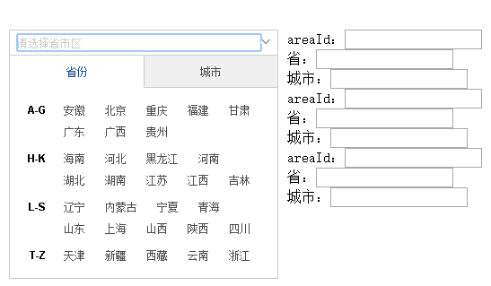
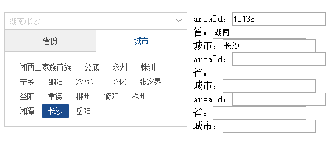

# city-select
城市选择控件


## 使用
		
			地址控件demo,在html里定义一个div,需要注意的是，这个控件默认的宽度是300px
			<div id="inputDiv1"></div>
		             然后在js里执行如下面三种初始代码即可，对应的选择会有回调函数
```javascript

##默认初始化 
	jQuery("#input1").citySelect({
		provinceSelected:function(province){
			
		},
		citySelected:function(areaId,province,city){
				jQuery("#areaId1").val(areaId);
				jQuery("#province1").val(province);
				jQuery("#city1").val(city);
		}
	});
##通过areaId初始化控件
	jQuery("#input2").citySelect({
		areaId:10145,
		provinceSelected:function(province){
			
		},
		/**
			选择城市里回调函数
		**/
		citySelected:function(areaId,province,city){
				jQuery("#areaId2").val(areaId);
				jQuery("#province2").val(province);
				jQuery("#city2").val(city);
		}
	});
##通过省、市初始化控件
	jQuery("#input3").citySelect({
		province:'湖南',
		city:'长沙',
		provinceSelected:function(province){
			
		},
		/**
			选择城市里回调函数
		**/
		citySelected:function(areaId,province,city){
				jQuery("#areaId3").val(areaId);
				jQuery("#province3").val(province);
				jQuery("#city3").val(city);
			}
		});
```

##效果图  
   效果图一：  
   
   效果图二：  
   
 
##Demo 请查看
```html 
		src/city-select-demo.html
```
